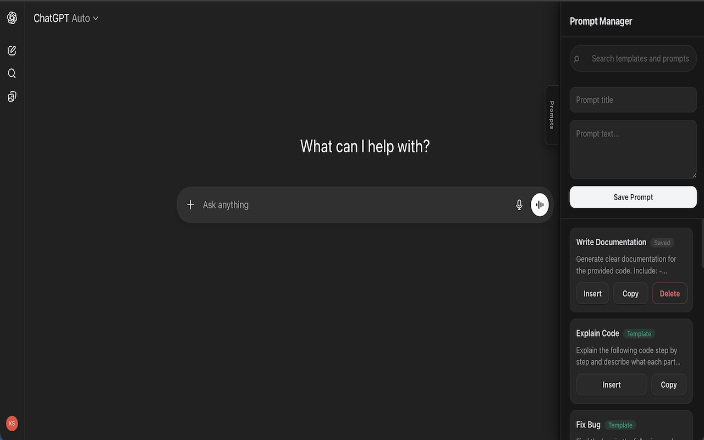
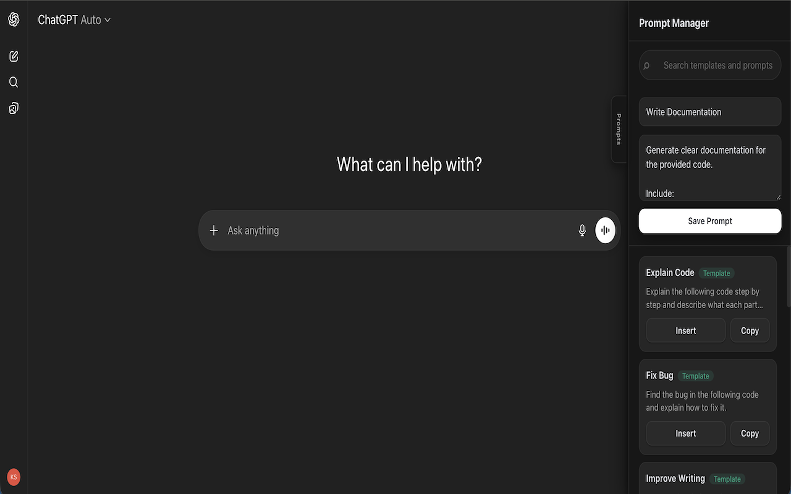
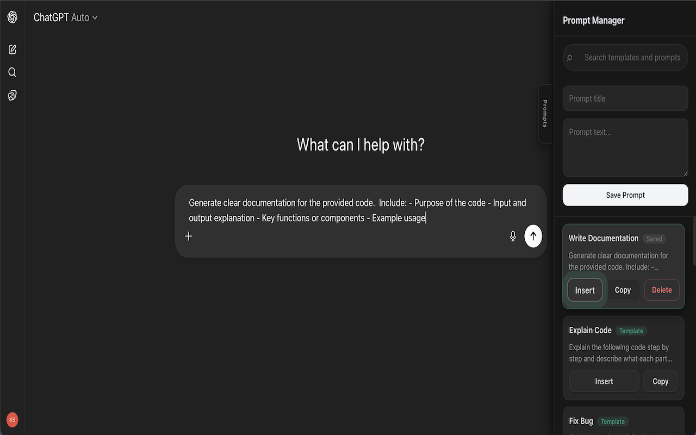
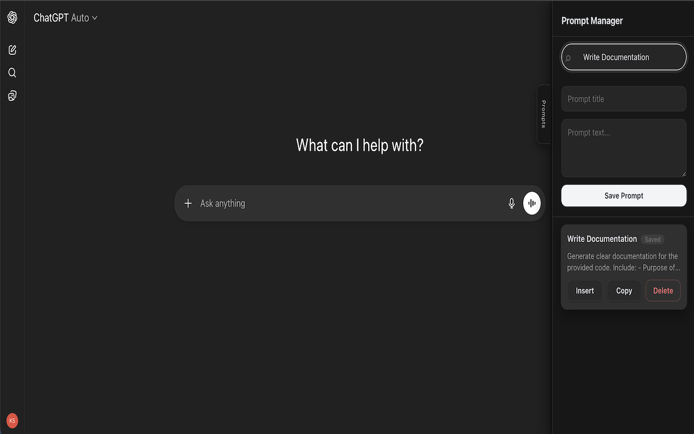

# ChatGPT Prompt Manager


**Install from Chrome Web Store:**  
https://chromewebstore.google.com/detail/dcenajemchddbjfffeljoncbkadjfjkf

## Short project description

ChatGPT Prompt Manager is a lightweight Chrome extension that injects a sidebar into ChatGPT pages, allowing users to save, search, copy, and reuse prompts without leaving the chat interface.

This is an MVP-style student/indie project focused on local prompt management inside the browser.

## Screenshot

Main Prompt Manager panel displayed inside ChatGPT.



## Features

Works on:
- `https://chat.openai.com/*`
- `https://chatgpt.com/*`

- Saves custom prompts (title + text) using `chrome.storage.local`
- Preloads built-in default prompt templates on first run
- Filters prompts with keyword search (matches title and prompt text)
- Inserts a prompt into the ChatGPT input box (append mode with spacing)
- Copies prompt text to clipboard
- Deletes saved prompts (template prompts are shown but not deletable)
- Supports light/dark styling synced with host page theme

## Tech stack

- Chrome Extension Manifest V3
- Vanilla JavaScript (content scripts, no framework)
- HTML + CSS (injected sidebar UI)
- `chrome.storage.local` for local persistence
- DOM manipulation via content scripts

## Project structure

```text
chatgpt-prompt-manager/
├─ manifest.json
├─ content/
│  ├─ content.js       # Sidebar injection, lifecycle, theme sync
│  ├─ sidebar.html     # Sidebar markup
│  ├─ sidebar.css      # Sidebar styles
│  └─ sidebar.js       # UI logic (search/save/insert/copy/delete)
├─ storage/
│  └─ storage.js       # Prompt storage helpers + default templates
├─ utils/
│  └─ dom.js           # ChatGPT input detection and text insertion
└─ icons/
   └─ icon.svg
```

## How it works

1. `manifest.json` registers content scripts for ChatGPT domains.
2. On page load, `content/content.js` waits for a usable chat input, creates `#pm-sidebar-root`, injects sidebar CSS, and fetches `content/sidebar.html`.
3. After sidebar markup is attached, it dispatches `pm-sidebar-ready`.
4. `content/sidebar.js` listens for that event and wires up UI behaviors:
   - load/render prompts
   - keyword search
   - save new prompt
   - delete saved prompt
   - copy prompt text
   - insert prompt text into ChatGPT input
5. `storage/storage.js` persists prompts in `chrome.storage.local` under `promptManager_prompts`, with in-memory caching and seeded default templates.
6. `utils/dom.js` provides input detection and safe text insertion for textarea/contenteditable input variants.

## Installation

1. Clone or download this repository locally.
2. Open Chrome and go to `chrome://extensions`.
3. Enable **Developer mode**.
4. Click **Load unpacked**.
5. Select this project folder (the folder that contains `manifest.json`).
6. Open ChatGPT at `https://chat.openai.com` or `https://chatgpt.com`.
7. Move to the right edge of the page or use the **Prompts** tab to open the sidebar.

## Usage

1. Open the Prompt Manager sidebar.
2. Add a new prompt:
   - Enter a title (optional)
   - Enter prompt text
   - Click **Save Prompt**
3. Use the search box to filter prompts by keyword.
4. Click:
   - **Insert** to append the prompt into the ChatGPT input field
   - **Copy** to copy prompt text to clipboard
   - **Delete** to remove a saved prompt

## Permissions used

- `storage`  
  Used to persist prompts locally via `chrome.storage.local`.

No backend service or remote database is used by this project.

## Current limitations

- Works only on `chat.openai.com` and `chatgpt.com`.
- Relies on ChatGPT DOM structure/selectors for input detection and UI injection; ChatGPT UI changes can break insertion or sidebar behavior.
- Data is local to the browser profile via `chrome.storage.local` (no sync across devices/accounts).
- No prompt editing flow (you can create and delete, but not edit in place).
- No import/export functionality.
- No categories/tags or advanced organization.
- No extension popup/options/settings page.
- No defined keyboard shortcut commands for extension actions.
- `manifest.json` references PNG icon files (`icon16.png`, `icon32.png`, `icon48.png`, `icon128.png`) that are not currently present in this repository.


## Future improvements

- Add prompt editing and duplicate management.
- Add import/export (JSON) for backup and migration.
- Add optional grouping/tagging for larger prompt collections.
- Improve resilience against ChatGPT DOM changes.
- Add an options page for configurable behavior.
- Add automated tests for storage and DOM interaction logic.

## More screenshots

### Save prompt
Create and store a new prompt locally in the browser.



### Insert prompt
Insert a saved prompt directly into the ChatGPT input area.



### Search prompts
Filter saved prompts with keyword search.



## License

This project is licensed under the MIT License.
